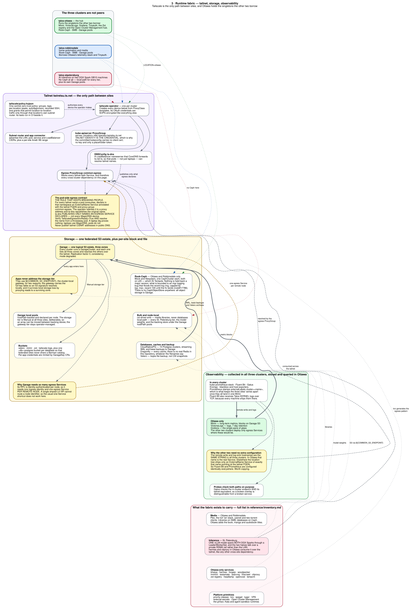

<div align="center">


### Keiretsu — Multi-Cluster Kubernetes Infrastructure

_Managed with Flux, Tailscale, and GitHub Actions_

</div>

<div align="center">

#### Ottawa

[](https://talos.dev)&nbsp;&nbsp;
[](https://kubernetes.io)&nbsp;&nbsp;
[](https://fluxcd.io)&nbsp;&nbsp;
[](https://tailscale.com/kb/1236/kubernetes-operator)

[](https://status.killinit.cc)&nbsp;&nbsp;
[](https://status.killinit.cc)&nbsp;&nbsp;

[](https://github.com/home-operations/kromgo)&nbsp;&nbsp;
[](https://github.com/home-operations/kromgo)&nbsp;&nbsp;
[](https://github.com/home-operations/kromgo)&nbsp;&nbsp;
[](https://github.com/home-operations/kromgo)&nbsp;&nbsp;
[](https://github.com/home-operations/kromgo)&nbsp;&nbsp;
[](https://github.com/home-operations/kromgo)&nbsp;&nbsp;
[](https://github.com/home-operations/kromgo)

</div>

<div align="center">

#### Robbinsdale

[](https://talos.dev)&nbsp;&nbsp;
[](https://kubernetes.io)&nbsp;&nbsp;
[](https://fluxcd.io)&nbsp;&nbsp;
[](https://tailscale.com/kb/1236/kubernetes-operator)

[](https://status.lukehouge.com)&nbsp;&nbsp;
[](https://status.lukehouge.com)&nbsp;&nbsp;

[](https://github.com/home-operations/kromgo)&nbsp;&nbsp;
[](https://github.com/home-operations/kromgo)&nbsp;&nbsp;
[](https://github.com/home-operations/kromgo)&nbsp;&nbsp;
[](https://github.com/home-operations/kromgo)&nbsp;&nbsp;
[](https://github.com/home-operations/kromgo)&nbsp;&nbsp;
[](https://github.com/home-operations/kromgo)&nbsp;&nbsp;
[](https://github.com/home-operations/kromgo)

</div>

<div align="center">

#### St. Petersburg

[](https://talos.dev)&nbsp;&nbsp;
[](https://kubernetes.io)&nbsp;&nbsp;
[](https://fluxcd.io)&nbsp;&nbsp;
[](https://tailscale.com/kb/1236/kubernetes-operator)

[](https://status.rajsingh.info)&nbsp;&nbsp;
[](https://status.rajsingh.info)&nbsp;&nbsp;

[](https://github.com/home-operations/kromgo)&nbsp;&nbsp;
[](https://github.com/home-operations/kromgo)&nbsp;&nbsp;
[](https://github.com/home-operations/kromgo)&nbsp;&nbsp;
[](https://github.com/home-operations/kromgo)&nbsp;&nbsp;
[](https://github.com/home-operations/kromgo)&nbsp;&nbsp;
[](https://github.com/home-operations/kromgo)&nbsp;&nbsp;
[](https://github.com/home-operations/kromgo)

</div>

---

Multi-cluster Kubernetes infrastructure managed with FluxCD GitOps. The three
Talos Linux clusters are connected by a Tailscale mesh and share the same
repository, platform conventions, and observability stack.

## Architecture

Three diagrams, each answering one question. They are meant to be read in
order, but each stands on its own. Click any of them for the full-size SVG —
GitHub scales them down to fit the page, and the labels are only legible at
full size. Each is committed in a light and a dark rendering, and served
through a `<picture>` element, so they follow your GitHub theme.

### 1 · Delivery — how a commit becomes running infrastructure

<a href="docs/diagrams/1-delivery.svg">
  <picture>
    <source media="(prefers-color-scheme: dark)" srcset="docs/diagrams/1-delivery.dark.svg">
    
  </picture>
</a>

The `main` branch is the only durable state. Flux polls it, decrypts the SOPS
material, and reconciles three top-level Kustomizations per cluster. The two
things worth internalising: an app is deployed to a cluster **because a pointer
file exists** in that cluster's location tree, and one `base/` directory can
serve all three clusters **because of the variable substitution stack** patched
into every pointer.

### 2 · North-south — how a request reaches a service

<a href="docs/diagrams/2-ingress.svg">
  <picture>
    <source media="(prefers-color-scheme: dark)" srcset="docs/diagrams/2-ingress.dark.svg">
    
  </picture>
</a>

Three tiers — public, private and tailnet — where a tier is a Gateway *plus*
the ExternalDNS instance that publishes it. The pairing is by label, so a route
joins a tier by attaching to its Gateway and gets DNS because that tier's
writer is watching for exactly that label. The trap the diagram calls out:
`${CLUSTER_DOMAIN}` names get DNS for free, `${COMMON_DOMAIN}` names do not.

### 3 · Runtime fabric — tailnet, storage and observability

<a href="docs/diagrams/3-fabric.svg">
  <picture>
    <source media="(prefers-color-scheme: dark)" srcset="docs/diagrams/3-fabric.dark.svg">
    
  </picture>
</a>

Tailscale is the only path between sites, and the three clusters are not peers:
Ottawa runs the singletons — Mimir, VictoriaLogs, Grafana, Tinyauth, the Zot
registry — that the other two borrow across the tailnet. Storage is one
federated Garage S3 estate spanning all three zones, with Ceph and SMB per
site. The amber boxes are constraints that have already caused an outage.

### Where the detail lives

The diagrams deliberately carry mechanism only. Anything that would not change
how an arrow is drawn lives in one of the two companion documents below:

| Where | Holds | Maintained |
|---|---|---|
| [`docs/diagrams/*.dot`](docs/diagrams) | what talks to what, and which way causality runs | by hand, reviewed in the diff |
| [`docs/reference/architecture.md`](docs/reference/architecture.md) | settings, versions, listener tables, and the reasoning behind each | by hand |
| [`docs/reference/inventory.md`](docs/reference/inventory.md) | every cluster, machine, pointer directory and Flux Kustomization | generated from the tree |

The inventory is generated, so it cannot disagree with the repository — it is
derived from the same pointer files that decide what is deployed. That is also
why the diagrams no longer list namespaces: they used to, and it made them
unreadable without making them any more accurate.

One thing to read carefully there: a pointer's *directory* is usually also the
namespace its objects land in, but a number of them set a different
`targetNamespace` — `auth/tinyauth.yaml` deploys into `tinyauth`, `velero` into
`velero-system`, `tuppr` into `system-upgrade`, `victoria-logs` into
`monitoring`. Each cluster's section ends with a table of its own exceptions, so
check there before reaching for `kubectl -n`.

```bash
tools/gen-inventory.sh     # regenerate the inventory after adding an app
tools/render-diagram.sh    # re-render the SVGs after editing a .dot
tools/check-diagram.sh     # what CI runs
tools/check-generated.sh   # regenerate/diff checked-in generated artifacts
```

`tools/check-diagram.sh` is a merge gate rather than a linter. It runs six
checks, and it is worth being precise about which of them actually catch drift:

| Check | What it guarantees |
|---|---|
| `SYNTAX` | every `.dot` parses as a real Graphviz graph |
| `SECRETS` | no key material, token, e-mail address, MAC address, hardware serial, public IP or tailnet CGNAT address in the diagrams or the reference docs |
| `STALE` | every committed SVG, light and dark, was rendered from the `.dot` beside it |
| `INVENTORY` | `inventory.md` byte-for-byte matches what the tree generates |
| `COVERAGE` | every location, cluster setting and Talos machine is described in a *hand-written* doc; every namespace and Flux Kustomization appears in the inventory; and no diagram names an app that is no longer deployed |
| `LINKS` | every diagram is shown in this README, and every diagram linked here exists |

So: adding an app without regenerating the inventory fails CI, and deleting an
app that a diagram still names fails CI. What the gate cannot do is prove that
a *sentence* in `architecture.md` is still true — prose is not machine-checkable,
and the coverage check deliberately excludes the generated inventory when
testing the hand-written docs so that it is not just confirming its own output.
Treat `architecture.md` as reviewed-by-humans and the inventory as derived.

Live values — pod counts, current versions, what is firing right now — are
deliberately absent. Those belong in Grafana and in the badges above, not in
files that only change when someone commits.

## Clusters

| Cluster | Site and nodes | Primary role | Storage | <code>${CLUSTER_DOMAIN}</code> |
|---------|----------------|--------------|---------|-------------------------|
| <code>talos-ottawa</code> | Ontario, Canada; 3 control planes (<code>rei</code>, <code>asuka</code>, <code>kaji</code>) plus worker <code>shiro</code> | Primary media, databases, and general workloads | Rook-Ceph, SMB, and local Garage pools | <code>killinit.cc</code> |
| <code>talos-robbinsdale</code> | Minnesota, US; 3 control planes (<code>tank</code>, <code>stone</code>, <code>titan</code>) and no workers | Home automation, media, and general workloads | Rook-Ceph, SMB, and local Garage pools | <code>lukehouge.com</code> |
| <code>talos-stpetersburg</code> | Florida, US; control plane <code>orin-0</code> plus GPU workers <code>spark-0</code> and <code>spark-1</code> | AI/ML inference and GPU workloads | Local-path and local Garage pools | <code>rajsingh.info</code> |

The shared domain is <code>keiretsu.top</code>. Cluster-specific Talos
versions, Kubernetes versions, node schematics, VIPs, and CIDRs are maintained
in each cluster's <code>bootstrap/talos/talconfig.yaml</code> and Flux settings,
and reported per cluster in
[<code>docs/reference/inventory.md</code>](docs/reference/inventory.md), which is
generated from those files. The table above is a summary; when the two disagree,
the generated one is right.

## Directory Structure

The app tree is [<code>kubernetes/</code>](kubernetes/README.md): configuration
lives once in <code>base/</code>, and clusters opt in with thin pointer files.
The location of a pointer is the deployment decision: an app is deployed only
to the clusters whose location tree contains that pointer.

~~~text
├── kubernetes/
│   ├── apps/base/<namespace>/<app>/ # real manifests, exactly once
│   ├── apps/ottawa/<namespace>/     # Ottawa Flux Kustomization pointers
│   ├── apps/robbinsdale/<namespace>/
│   ├── apps/stpetersburg/<namespace>/
│   └── components/                  # reusable Kustomize components
├── clusters/
│   ├── common/
│   │   ├── bootstrap/flux/           # one-time Flux install bundle
│   │   └── flux/                     # shared sources and settings
│   ├── talos-ottawa/
│   │   ├── bootstrap/talos/          # talhelper config and patches
│   │   ├── flux/                     # cluster Flux entrypoint and variables
│   │   ├── jobs/                     # site-specific diagnostic jobs
│   │   └── scripts/                  # site operations
│   ├── talos-robbinsdale/            # Talos, Flux, jobs, and site config
│   └── talos-stpetersburg/           # Talos, Flux, jobs, and site config
├── tailscale/                        # HuJSON policy and automation scripts
├── tools/                            # render gate and read-only helpers
├── docs/                             # references, ADRs, and runbooks
└── Makefile                          # rendered diff helper
~~~

Legacy or supplemental content remains under <code>clusters/*/apps</code> while
the application migration is completed. Check references with
<code>tools/refs.sh &lt;name&gt;</code> before changing or removing one of those
files. New apps belong under <code>kubernetes/apps/base/</code> with location
pointers.

## GitOps and Flux Architecture

Each cluster has a GitRepository and three top-level Flux Kustomizations in
<code>clusters/talos-&lt;location&gt;/flux/config/cluster.yaml</code>:

- <code>cluster</code> reconciles the cluster's Flux configuration and variables.
- <code>common-cluster</code> reconciles shared sources and variables from
  <code>clusters/common/flux/</code>.
- <code>kubernetes-apps</code> reconciles
  <code>kubernetes/apps/&lt;location&gt;/</code>, which lists the location's
  namespaces and app pointers.

The app Kustomization enables SOPS decryption and supplies this substitution
stack to child pointers:

~~~text
common-settings
common-secrets
cluster-settings
cluster-secrets
cluster-user-settings       # optional
cluster-user-secrets        # optional
garage-keiretsu-bucket      # optional
~~~

Child Kustomizations can add dependencies, waits, timeouts, and their own
post-build substitution. Flux follows the <code>main</code> branch of this
repository; changes become durable only after they are committed and
reconciled.

### SOPS Secret Encryption

Secret material is encrypted with SOPS/PGP using key
<code>FAC8E7C3A2BC7DEE58A01C5928E1AB8AF0CF07A5</code>. Creation rules live
beside each tree in <code>.sops.yaml</code> files. Never commit plaintext
secrets, kubeconfigs, <code>talsecret.yaml</code>, private keys, or decrypted
<code>*.dec</code> files.

~~~yaml
# representative creation rule
creation_rules:
  - path_regex: .*.yaml$
    encrypted_regex: ^(data|stringData)$
    pgp: FAC8E7C3A2BC7DEE58A01C5928E1AB8AF0CF07A5
~~~

### Tailscale Integration

The official Tailscale Kubernetes operator is deployed through
<code>kubernetes/apps/base/tailscale/operator</code>. Its companion resources
and workloads are split between <code>tailscale/resources</code> and
<code>tailscale-system/tailscale-system-app</code>. The deployment includes:

- subnet-router Connectors for LAN, service, pod, and load-balancer CIDRs;
- per-location PeerRelay and ProxyGroups for common ingress/egress;
- ProxyClasses such as <code>common</code>,
  <code>common-accept-routes</code>, and <code>common-userspace</code>;
- DNSConfig for pod-side tailnet name resolution;
- cross-cluster API and service egress;
- SSH recording and the custom CSI provider.

See [the Tailscale integration reference](docs/reference/tailscale-integration.md)
for the policy, operator resources, egress contract, and CI workflows.

## Platform and Workload Inventory

The summary below is a reading aid, not a source of truth. The exact inventory
is derived from the location pointers: see
[<code>docs/reference/inventory.md</code>](docs/reference/inventory.md) for
every namespace and Flux Kustomization per cluster (regenerate it with
<code>tools/gen-inventory.sh</code>), or <code>tools/app.sh --list</code> for
the app-to-base-to-cluster mapping.

### Shared platform

- Cilium CNI, Hubble, CoreDNS customization, Envoy Gateway, and Gateway API
  routes.
- Flux Operator/Instance, cert-manager, External Secrets, Node Feature
  Discovery, KRO, VPA, snapshot-controller, and local-path storage.
- Tailscale operator/resources/system, Cloudflare ExternalDNS, K8GB, and
  Open Cluster Management agents.
- Agent Sandbox, gVisor, Spegel, GitHub Actions Runner Controller, and
  cluster-specific Kata runtimes where selected by a location pointer.

### Observability

- kube-prometheus-stack, Grafana dashboards/plugins, Mimir, Victoria Logs,
  Fluent Bit, Gatus, Kromgo, blackbox-exporter, smartctl-exporter, and UniFi
  Unpoller.

### Data and storage

- Rook-Ceph is deployed in Ottawa and Robbinsdale.
- Garage provides federated S3-compatible storage across all three clusters,
  with per-node local pools and gateway services.
- CloudNativePG, Dragonfly, CSI SMB, Velero, and Zot provide database,
  backup, file-storage, and registry capabilities.

### Location workloads

- **Ottawa:** media, Immich, Forgejo, Woodpecker, Hermes, agents, Firecrawl,
  CLIProxy, TeslaMate, SearXNG, Bhaiya integration, Monz,
  Headlamp, OpenCost, the GPU DRA driver, Kata, and LAN services.
- **Robbinsdale:** media, Immich, Speedtest, and Strimzi/Kafka workloads,
  alongside the shared home and storage platform.
- **St. Petersburg:** GLM-5.3/vLLM inference on the DGX Spark workers,
  NVIDIA GPU Operator, LeaderWorkerSet, RDMA device plugin, Home Assistant,
  and the local Garage storage tier.

## Prerequisites

Install the tools through <code>mise</code> from the cluster directory:

~~~bash
brew install mise gpg
cd clusters/talos-<location>
mise install
~~~

The per-cluster <code>.mise.toml</code> installs Task, talhelper, talosctl,
SOPS, kubectl, and Helmfile. Install the Flux CLI separately if you need the
live Flux commands below. Import and trust the repository's SOPS key:

~~~bash
gpg --import /path/to/sops.asc
echo "FAC8E7C3A2BC7DEE58A01C5928E1AB8AF0CF07A5:6:" | gpg --import-ownertrust
gpg --list-secret-keys | grep FAC8E7C3A2BC7DEE58A01C5928E1AB8AF0CF07A5
~~~

## Bootstrap a Talos Cluster

The detailed Talos reference is
[<code>docs/reference/talos.md</code>](docs/reference/talos.md). Ottawa and
St. Petersburg also have hardware-specific guides in their Talos bootstrap
directories.

### Fresh-install sequence

~~~bash
cd clusters/talos-<location>
mise install

# Fresh installations only: create new cluster CA/etcd/node secrets.
mise run init

# Generate clusterconfig/ from talconfig.yaml and the encrypted secret.
mise run genconfig

# Nodes must be in Talos maintenance mode for the initial apply.
mise run apply-insecure
mise run bootstrap
mise run kubeconfig
mise run health
~~~

For an already-installed cluster, use <code>mise run apply</code> for a normal
configuration change or <code>mise run apply-staged</code> when the change
should wait for the next reboot. Generated <code>clusterconfig/</code> files
and kubeconfigs are ignored and must not be committed.

St. Petersburg has two installation images: run <code>mise run iso-spark</code>
for the DGX Spark workers and <code>mise run iso-orin</code> for the Jetson
control plane. Its maintenance-mode task is
<code>mise run apply-orin-insecure &lt;orin-ip&gt;</code> when the Orin address
cannot be resolved yet.

The one-time Flux controller/CRD bundle is kept at
<code>clusters/common/bootstrap/flux/</code>; it is explicitly not reconciled
by Flux. After the initial Flux bootstrap, the committed file
<code>clusters/talos-&lt;location&gt;/flux/config/cluster.yaml</code> creates the
GitRepository and the three reconciliation layers described above. Cilium,
gateways, and workloads are then installed by Flux. Do not
<code>helm install</code>, <code>kubectl apply</code>, or
<code>kubectl create</code> durable cluster resources manually.

## Adding a New Application

Read the complete worked example in
[<code>docs/reference/app-template.md</code>](docs/reference/app-template.md),
and the tree/migration notes in
[<code>kubernetes/README.md</code>](kubernetes/README.md). The short version is:

### 1. Create the base

~~~bash
mkdir -p kubernetes/apps/base/<namespace>/<app>
~~~

Add a <code>kustomization.yaml</code> and the app's raw manifests or
HelmRelease. Add a HelmRepository under
<code>clusters/common/flux/repositories/helm/</code> first when a new chart
source is needed, and list it in that directory's Kustomization.

### 2. Add one pointer per target cluster

<code>kubernetes/apps/&lt;location&gt;/&lt;namespace&gt;/&lt;app&gt;.yaml</code> is
the deployment opt-in. The pointer's Flux Kustomization should retain the app
identity in <code>metadata.name</code>, point at the base, and inherit the
substitution stack:

~~~yaml
apiVersion: kustomize.toolkit.fluxcd.io/v1
kind: Kustomization
metadata:
  name: &app <app>
  namespace: flux-system
spec:
  targetNamespace: <namespace>
  commonMetadata:
    labels:
      app.kubernetes.io/name: *app
  path: ./kubernetes/apps/base/<namespace>/<app>
  prune: true
  sourceRef:
    kind: GitRepository
    name: kubernetes-manifests
  interval: 30m
  retryInterval: 1m
  timeout: 5m
  postBuild:
    substituteFrom:
      - { kind: ConfigMap, name: common-settings }
      - { kind: Secret, name: common-secrets }
      - { kind: ConfigMap, name: cluster-settings }
      - { kind: Secret, name: cluster-secrets }
~~~

<code>postBuild</code> can be omitted entirely: the parent
<code>kubernetes-apps</code> Kustomization patches the full seven-entry stack
listed above into every child, overriding whatever a pointer declares. Only the
last three entries are optional; a missing <code>cluster-settings</code> or
<code>cluster-secrets</code> is a hard failure.

List the pointer in
<code>kubernetes/apps/&lt;location&gt;/&lt;namespace&gt;/kustomization.yaml</code>.
If the app owns a new namespace, list its <code>namespace.yaml</code> there and
retain <code>kustomize.toolkit.fluxcd.io/prune: disabled</code> on the
namespace. Finally list the namespace directory in the location root
Kustomization.

### 3. Ingress

Put an HTTPRoute beside the app when it needs HTTP access. The
<code>ts</code>, <code>private</code>, and <code>public</code> Gateways live in
namespace <code>home</code>. Check listener hostnames before choosing a parent:

~~~bash
tools/kc.sh ot -n home get gateway ts -o jsonpath='{.spec.listeners[*].hostname}'
~~~

Use <code>&lt;app&gt;.${CLUSTER_DOMAIN}</code> for a location domain;
ExternalDNS watches those HTTPRoutes and creates the record.
<code>&lt;app&gt;.${COMMON_DOMAIN}</code> names are not created automatically:
add a DNS-only CNAME to
<code>kubernetes/apps/base/k8gb/k8gb-common/config/cnames.yaml</code>, targeting
<code>ottawa.${COMMON_DOMAIN}</code> for an Ottawa-only route or the appropriate
<code>&lt;name&gt;.cdn.${COMMON_DOMAIN}</code> GSLB name for a multi-cluster route.

### 4. Tailnet targets and auth

For every tailnet hostname consumed by a pod, create an ExternalName Service
with <code>tailscale.com/tailnet-fqdn</code> and
<code>tailscale.com/proxy-group: common-egress</code>. Do not publish Tailscale
CGNAT addresses in public DNS; see the
[Tailscale reference](docs/reference/tailscale-integration.md) for the
readiness and pod-DNS checks.

Tinyauth provides Google authentication for protected web routes. Authorization
is route-local through an Envoy Gateway SecurityPolicy using the identity
headers injected by Tinyauth. The primary instance serves
<code>keiretsu.top</code>; Ottawa's <code>tinyauth-killinit</code> instance
serves <code>killinit.cc</code>. Internal tailnet-only routes can rely on
tailnet policy instead.

### 5. Validate

Run the bounded render gate before committing:

~~~bash
tools/check.sh <location>  # talos-ottawa, talos-robbinsdale, or talos-stpetersburg
~~~

Use <code>tools/check.sh</code> for all three clusters when a shared or
multi-location change is involved. Do not substitute raw
<code>make test</code> or <code>kustomize build</code>; the helper uses the
CI-pinned Flate release and controls noisy output.

## Common Operations

### Flux commands

~~~bash
flux get ks -A
flux get hr -A

flux reconcile kustomization kubernetes-apps -n flux-system
flux reconcile source git kubernetes-manifests -n flux-system

flux suspend ks <name> -n flux-system
flux resume ks <name> -n flux-system
~~~

Do not use <code>--watch</code> or sleep-based polling in CI or operational
checks. Inspect once, then perform other work before checking again.

### Read-only cluster access

Use <code>tools/kc.sh</code>, which selects the repository's canonical
<code>.kube/config</code> and the correct Tailscale API context:

| Alias | Cluster | API operator hostname |
|-------|---------|-----------------------|
| <code>ot</code> | Ottawa | <code>ottawa-k8s-operator.keiretsu.ts.net</code> |
| <code>rb</code> | Robbinsdale | <code>robbinsdale-k8s-operator.keiretsu.ts.net</code> |
| <code>sp</code> | St. Petersburg | <code>stpetersburg-k8s-operator.keiretsu.ts.net</code> |

~~~bash
tools/kc.sh ot get nodes
tools/kc.sh rb get ns
tools/kc.sh sp -n ai get pods
tools/ktriage.sh ot media <pod-name>
~~~

The tracked root <code>.kube/config</code> contains operator URLs and a
placeholder token, not credentials. Never add certificates, keys, or real
tokens. Services are reachable over the Tailscale network; port-forwarding is
normally unnecessary.

### Talos commands

~~~bash
cd clusters/talos-ottawa
mise run health
mise run dashboard
mise run nodes
mise run pods
~~~

The same <code>mise run</code> task names are available in the Robbinsdale and
St. Petersburg directories, with St. Petersburg adding <code>gpu-status</code>
and its two image tasks. Talos control-plane patches are rolling operations:
patch one node, verify etcd, API readiness, and every node's Ready state before
touching the next; handle the VIP holder last.

### Secret management

~~~bash
cd clusters/common
sops flux/vars/common-secrets.sops.yaml

cd ../talos-ottawa
sops flux/vars/cluster-secrets.sops.yaml
~~~

Run SOPS from the directory whose <code>.sops.yaml</code> contains the creation
rules. Use <code>sops -d</code> only for controlled inspection, never to create
a tracked plaintext copy. Values containing <code>$</code> must be stored in a
Secret or ConfigMap and injected through a Flux variable; bare dollar signs are
consumed by Flux envsubst. In raw manifests, write
<code>$${VAR}</code> when the rendered manifest needs a literal
<code>${VAR}</code>.

### Validation and diagnostics

Every PR touching <code>clusters/**</code>, <code>kubernetes/**</code>, the
render helpers, or the Flate workflow runs the Flate matrix and per-cluster
rendered-diff workflow. The local gate uses the same CI-pinned Flate release
and compares the render with the default-remote merge-base, so stable
failures from a cold cache do not make a clean tree red. Set
<code>KMAN_CHECK_FULL_TREE=1</code> for a full-tree diagnostic:

~~~bash
tools/check.sh
make diff
tools/check-versions.sh
tools/check-diagram.sh
tools/check-generated.sh
tools/render-diagram.sh
tools/gen-inventory.sh
tools/orphans.sh
tools/tests/run.sh
~~~

<code>tools/check.sh</code> prints one success line. Exit 124 means the render
process group was killed by the timeout and should be retried; a render that
exits with its own diagnostics is a real failure. The version checker enforces
coupled Talos/tuppr and Rook/Ceph/toolbox versions,
<code>tools/check-diagram.sh</code> holds the architecture documentation to the
tree on disk and verifies each committed SVG was rendered from the
<code>.dot</code> beside it (re-render with
<code>tools/render-diagram.sh</code>, regenerate the inventory with
<code>tools/gen-inventory.sh</code>), and <code>tools/orphans.sh</code>
detects Kustomization-to-disk drift.

## Networking Reference

A summary. The authoritative per-cluster values are generated into
[<code>docs/reference/inventory.md</code>](docs/reference/inventory.md), and the
reasoning behind the ingress and DNS design is in
[<code>docs/reference/architecture.md</code>](docs/reference/architecture.md#north-south-ingress).

### Cluster CIDRs

| Cluster | LAN / API VIP | Pod CIDR | Service CIDR | LoadBalancer CIDR |
|---------|---------------|----------|--------------|-------------------|
| <code>talos-ottawa</code> | <code>192.168.169.0/24</code> / <code>192.168.169.25</code> | <code>10.3.0.0/16</code> | <code>10.2.0.0/16</code> | <code>10.169.0.0/16</code> |
| <code>talos-robbinsdale</code> | <code>192.168.50.0/24</code> / <code>192.168.50.25</code> | <code>10.1.0.0/16</code> | <code>10.0.0.0/16</code> | <code>10.50.0.0/16</code> |
| <code>talos-stpetersburg</code> | <code>192.168.73.0/24</code> / <code>192.168.73.25</code> | <code>10.5.0.0/16</code> | <code>10.4.0.0/16</code> | <code>10.73.0.0/16</code> |

### Tailscale DNS and Gateway API

Operator and service names use the <code>keiretsu.ts.net</code> tailnet. Pods
do not automatically receive every MagicDNS device record; workloads that
consume a tailnet name need the common-egress ExternalName Service pattern
described above. A successful laptop <code>dig</code> is not sufficient—verify
the generated egress Service condition and resolution from a pod.

The Gateway API exposure tiers are:

- <code>ts</code>: tailnet ingress;
- <code>private</code>: site-private ingress;
- <code>public</code>: Internet-facing ingress.

All three live in namespace <code>home</code> and all three accept every
cluster domain — <code>*.killinit.cc</code>, <code>*.lukehouge.com</code> and
<code>*.rajsingh.info</code> — not just the local one. They differ in the
shared zone and in what else they carry:

- <code>public</code> has 14 listeners: the three cluster wildcards plus
  <code>*.keiretsu.top</code>, the bare <code>keiretsu.top</code> apex, and
  dedicated <code>*.hermes</code>, <code>*.${LOCATION}</code>,
  <code>*.bhaiya</code>, <code>*.cdn</code> and <code>*.s3</code>
  sub-wildcards, plus HTTP :80, Forgejo SSH on TCP :22, and Frigate WebRTC on
  TCP/UDP :8555.
- <code>private</code> has 6: HTTP :80, the four wildcards, and Forgejo SSH.
- <code>ts</code> has 8 and serves <code>*.ts.keiretsu.top</code> —
  <strong>not</strong> <code>*.keiretsu.top</code> — plus HTTP :80, Pi-hole DNS
  on TCP/UDP :53, and Forgejo SSH.

Each tier also has its own DNS plane: routes on <code>public</code> are
published to Cloudflare, routes on <code>private</code> to the UniFi
controller, and routes on <code>ts</code> to Pi-hole, selected by the
<code>gateway=public</code>, <code>external-dns=private</code> and
<code>external-dns=ts</code> labels respectively. Check the actual listener
list before adding a route.

## Links

- [FluxCD Documentation](https://fluxcd.io/docs/)
- [Talos Linux](https://www.talos.dev/latest/)
- [Talhelper](https://github.com/budimanjojo/talhelper)
- [SOPS](https://github.com/getsops/sops)
- [Tailscale Kubernetes Operator](https://tailscale.com/kb/1236/kubernetes-operator)
- [Flate](https://github.com/home-operations/flate) — offline Flux manifest renderer
- [Repository contribution guide](CONTRIBUTING.md)
- [**Architecture reference**](docs/reference/architecture.md) — the detailed
  companion to the three diagrams above: settings, versions, blast radius,
  upgrade ordering, and the reasoning behind each
- [**Deployment inventory**](docs/reference/inventory.md) — generated: every
  cluster, machine, pointer directory and Flux Kustomization
- [Talos reference](docs/reference/talos.md)
- [New-app template](docs/reference/app-template.md)
- [Tailscale integration reference](docs/reference/tailscale-integration.md)

## Support

For cluster-specific bootstrap details, start with the Talos reference and the
README files in <code>clusters/talos-*/bootstrap/talos/</code> where present.
For application layout and migration questions, use
[<code>kubernetes/README.md</code>](kubernetes/README.md).
